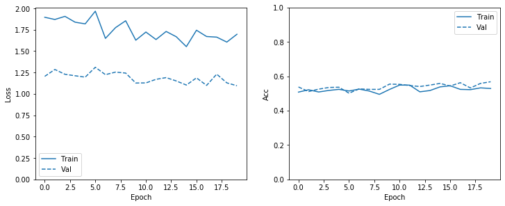
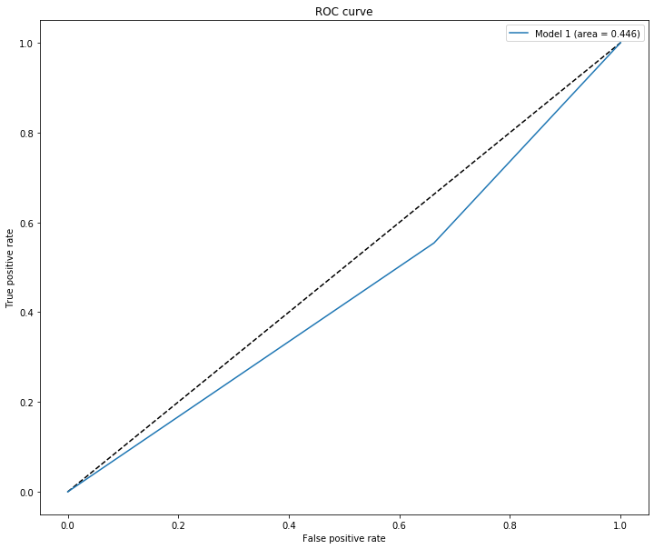

# Can Deep Learning Discern a Portrait Artist's Gender?

## Introduction

Anecdotally, certain artists throughout history have been vaunted for their feminine or masculine art styles, particularly when depicting human forms. Also, the recent popularity the subreddit [r/MenDrawingWomen](https://www.reddit.com/r/mendrawingwomen/) has highlighted some of the vulgar inaccuracies of some male artist's depictions of the female body. Realistically I do not think I am personally able to determine an artist's gender purely based on their art.

But are there visual elements in portrait art contain sutble clues to an artist's gender? If so perhaps the rapidly evolving deep learning image classification models would be able to discern an artist's gender based on artwork alone.

## Aim
Use state-of-the-art image classification techniques to analyse portraits across a diverse range of artists to classify artist's gender significantly better than in 50% of cases.

## Data Preparation
Through research the [Kaggle Painter By Numbers](https://www.kaggle.com/c/painter-by-numbers) dataset was obtained. A subset of 3636 portraits (excluding self-portraits). To narrow the range of art styles, only portraits created year 1900 or later across a variety of styles were included. 

Each artist was manually referenced against Wikipedia data to determine their gender with males labelled '0' and females labelled '1'. Notably, only 400 of the 3636 portraits was by a female artist so class imbalance would need to be addressed.

A 80% train / 20% validation split of the dataset was performed.

## Model Selection

I reviewed the 2020 state-of-the-art image classifcation models for transfer learning/fine-tuning, noisy student and efficientnet models stood out as best performers on the imagenet benchmark.

Looking over the noisy student paper, this model improved its initial model results with further unlabelled data, which I do not currently posses. Efficientnet was loosely based on resnet but less resource intensive without sacrificing performance. Thus, the simplest version efficientnet-b0 was chosen and [Chengwei Zhang's Keras-based efficientnet transfer learning notebook](https://github.com/Tony607/efficientnet_keras_transfer_learning/blob/master/Keras_efficientnet_transfer_learning.ipynb) used for reference.

### Model 1 with class weights of proportional values
The introduction of class weights that are proportional to the class imbalance modestly improve the number of correctly predicted female artists, but at the cost of a significant increase in misclassifed male artists. Consequently, the ROC curve demonstrates the area-under-curve is less than 0.5.

#### Training Accuracy & Loss
 

#### Confusion Matrix
 
[[ 27  53]

 [289 359]]
 
 #### ROC Curve

## Conclusion
After implementing proportional class weights to overcome class imbalance and fine-tuning the base model, there was not significant improvement in predictive performance. There is no suggestion in this simple exploration that state-of-the-art image classification models are able to discern a portrait artist's gender above a baseline of 50%.

## Future Work
Perhaps by narrowing the range of styles in the dataset to simpler brush stroke art, such as monochrome manga or webcomics, there may be some improvements to performance and this may be explored in further work.

Also, it would be beneficial to source an independent test set for better model comparision.

