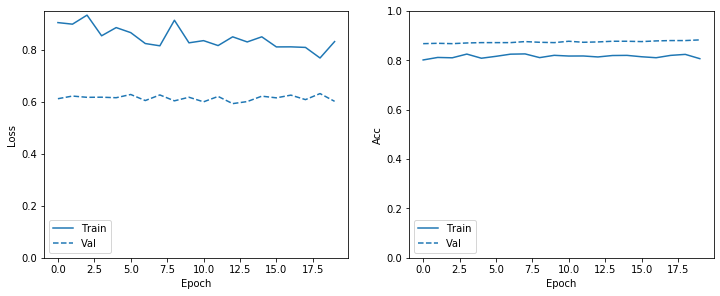
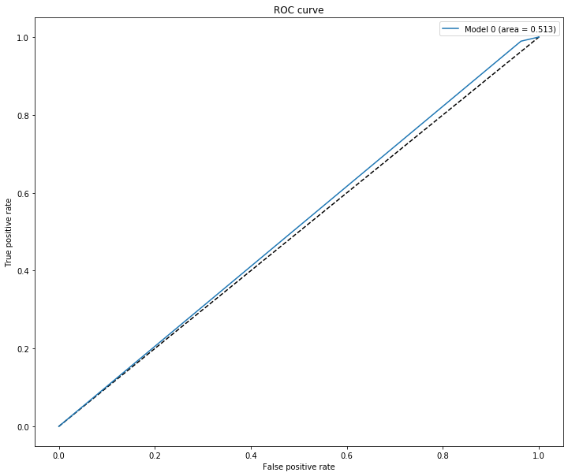
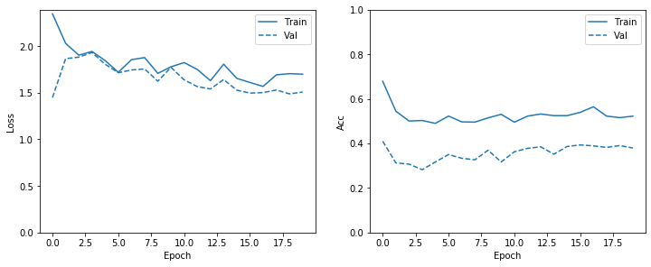
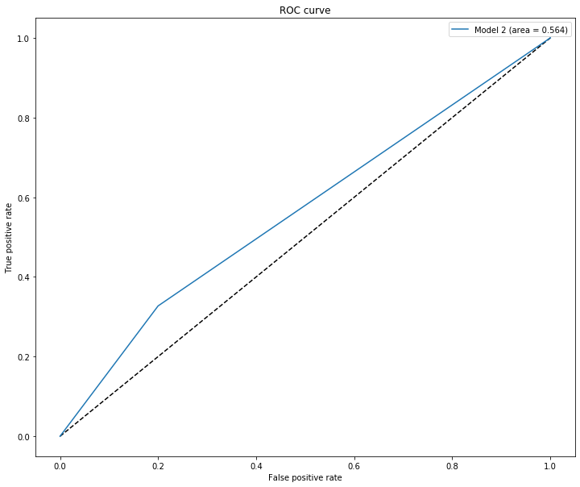
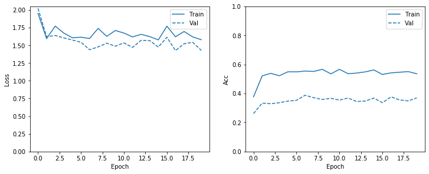
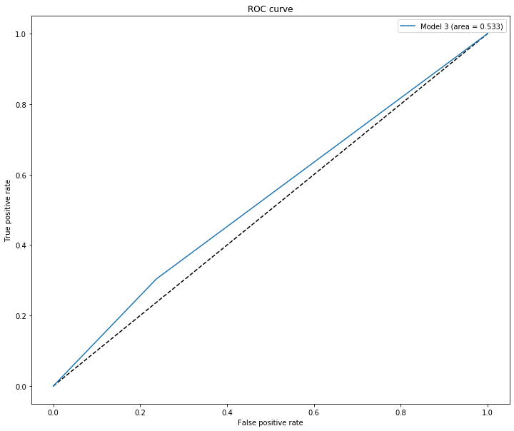
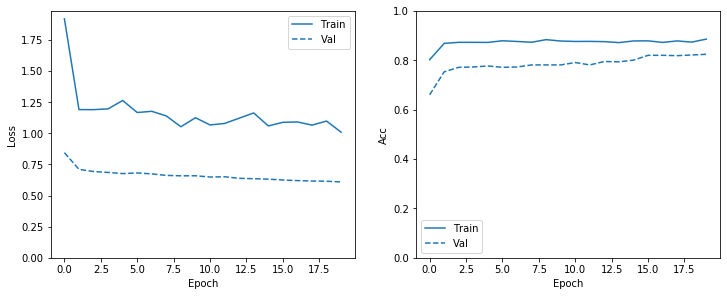
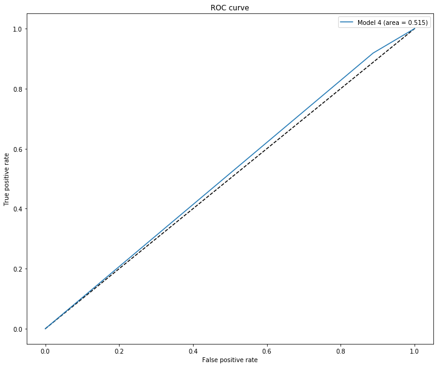

# Can Deep Learning Discern a Portrait Artist's Gender?

## Introduction 

Anecdotally, certain artists throughout history have been vaunted for their feminine or masculine art styles, particularly when depicting human forms. Also, the recent popularity the subreddit [r/MenDrawingWomen](https://www.reddit.com/r/mendrawingwomen/) has highlighted some of the vulgar inaccuracies of some male artist's depictions of the female body. Realistically I do not think I am personally able to determine an artist's gender purely based on their art.

But are there visual elements in portrait art contain sutble clues to an artist's gender? If so perhaps the rapidly evolving deep learning image classification models would be able to discern an artist's gender based on artwork alone.

## Aim
Use state-of-the-art image classification techniques to analyse portraits across a diverse range of artists to classify artist's gender significantly better than in 50% of cases.

## Data Preparation
Through research the [Kaggle Painter By Numbers](https://www.kaggle.com/c/painter-by-numbers) dataset was obtained. A subset of 3636 portraits (excluding self-portraits). To narrow the range of art styles, only portraits created year 1900 or later across a variety of styles were included. 

Each artist was manually referenced against Wikipedia data to determine their gender with males labelled '0' and females labelled '1'. Notably, only 400 of the 3636 portraits was by a female artist so class imbalance would need to be addressed.

A 80% train / 20% validation split of the dataset was performed.

## Model Selection

I reviewed the 2020 state-of-the-art image classifcation models for transfer learning/fine-tuning, noisy student and efficientnet models stood out as best performers on the imagenet benchmark.

Looking over the noisy student paper, this model improved its initial model results with further unlabelled data, which I do not currently posses. Efficientnet was loosely based on resnet but less resource intensive without sacrificing performance. Thus, the simplest version efficientnet-b0 was chosen and [Chengwei Zhang's Keras-based efficientnet transfer learning notebook](https://github.com/Tony607/efficientnet_keras_transfer_learning/blob/master/Keras_efficientnet_transfer_learning.ipynb) used for reference.

### Output - Baseline Model 0 with imbalanced data (no class weights)
The confusion matrix suggests the model is overly incentivised to predict 'male' due the the data imbalance.

 #### Training Accuracy & Loss
 

 
#### Confusion Matrix

[[ 3  77 ]
 
 [ 7 641 ]]
 
#### ROC Curve

### Model 1 with class weights of proportional values
The introduction of class weights that are proportional to the class imbalance modestly improve the number of correctly predicted female artists, but at the cost of a significant increase in misclassifed male artists. Consequently, the ROC curve demonstrates the area-under-curve is less than 0.5.

#### Training Accuracy & Loss
 

#### Confusion Matrix
 
[[ 27  53]

 [289 359]]
 
 #### ROC Curve

### Output - Model 2 - Finetune last few layers (with proportional class weights)
Configuring the model to fine-tune the final layers further increases the correctly classified female artists but the male classifications has worsened further. The ROC curve suggests model 2 outperforms model 1, but is still with and area-under-curve of 0.56 and not materially improved over random guessing.

#### Training Accuracy & Loss
 

#### Confusion Matrix

[[ 64  16]

 [436 212]]
 
#### ROC Curve

### Output - Model 3 - smoothed class weights without finetune
Given model 2's extreme focus on correctly predicting female artists, I thought to halve the female class weight and remove finetuning to see if the improvement in male artist prediction would generally improve the model. However, as the ROC curve shows, it sacrificed the female predictive ability more than it benefited male prediction to reuslt in an area-under-curve of just 0.533.
#### Training Accuracy & Loss
 

#### Confusion Matrix

[[ 61  19]

 [451 197]]

 
 #### ROC Curve

### Output - Model 4 - smoothed class weights (WITH finetune)
For the sake of comparision, model 4 maintained the halved class weights of model 3 but included finetuning. Unfortunately this reverted the model to overly focusing on predicting male artists correctly and the area-under-curve remained low at 0.515.

#### Training Accuracy & Loss
 

#### Confusion Matrix
 
[[  9  71]

 [ 53 595]]
 
#### ROC Curve

## Conclusion
After implementing proportional class weights to overcome class imbalance and fine-tuning the base model, there was not significant improvement in predictive performance. There is no suggestion in this simple exploration that state-of-the-art image classification models are able to discern a portrait artist's gender above a baseline of 50%. This dataset combines a wide variety of mediums from simplistic line-art sketches to elaborately rendered oil paintings and with this modestly sized 3000+ image dataset, it may be too broad in scope to expect the model to achieve robust discrimination. 

Further, the class imbalance present where the overwhelming majority of art was from male artists may have impaired the ability to learn differentiating elements based on gender. 

Finally, the model's inability to discern the artist's gender may actually reflect that there is no broad difference in art based on the artists gender that can be generalized and the artist's individual idiosyncrasies are more significant.

## Future Work
Further analysis of the results broken down by art styles could be produced to analyze which art styles the model had more or less success in predicting. Also, it would be beneficial to source an independent test set for better comparison across models. Perhaps by narrowing the range of styles in the dataset to simpler brush stroke art, such as monochrome manga or webcomics, there may be some improvements to performance and this may be explored in further work. 

Further, volunteers could be asked via a survey to guess an artist's gender may assist to get a general sense of a human benchmark for gender identification.

